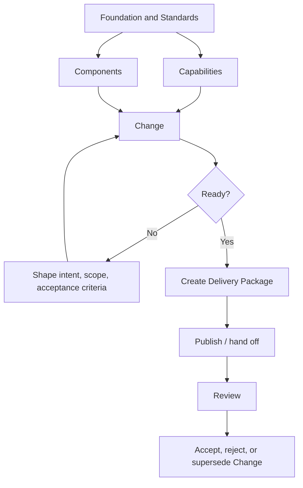

# Problem and Target Model

## Current modelling issue

The current app allows capabilities and components to create delivery packages directly. That makes capabilities/components do two separate jobs:

1. Describe stable product/system understanding.
2. Define a specific piece of implementation work.

That creates drift because a capability can be broad, long-lived, partially implemented, revised many times, or implemented in several stages. A component can also evolve through many unrelated changes.

The missing concept is the intentional unit of work.

## Target model

```text
Foundation  = why the project exists, who it is for, and what matters.
Standards   = how work should be done.
Capability  = what the system/product should be able to do.
Component   = where responsibility, source mapping, and technical ownership live.
Change      = what we intend to alter now, and why.
Delivery    = how ready changes are scheduled, packaged, handed off, reviewed, and published.
Review      = whether delivered work matched the stated change intent.
```

## Core principle

```text
Capability = stable intent/context.
Component  = stable system area/ownership.
Change     = scoped work intent.
Delivery   = execution bundle.
```

## Practical example

A capability may say:

> Users can define and maintain product goals.

Several Changes may implement that over time:

- Add measurable success criteria to goals.
- Add drag/drop review packaging for goals.
- Add prioritisation to goals.
- Refactor the markdown editor used by the goals section.

All four Changes link to the same capability, but each has a different intent, scope, risk, acceptance criteria, and delivery history.

## Target flow


